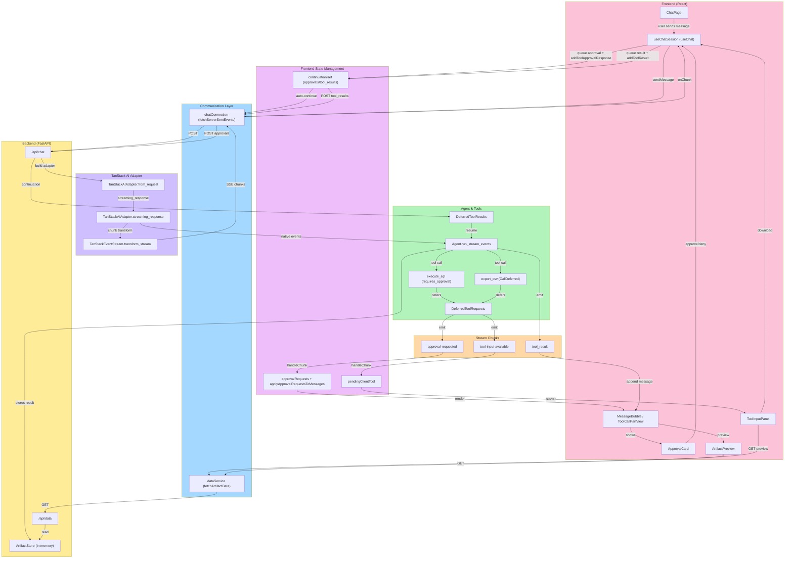

```mermaid
graph TB
    subgraph Frontend["Frontend (React)"]
        ChatPage["ChatPage"]
        useChatSession["useChatSession (useChat)"]
        MessageBubble["MessageBubble / ToolCallPartView"]
        ApprovalCard["ApprovalCard"]
        ToolInputPanel["ToolInputPanel"]
        ArtifactPreview["ArtifactPreview"]
    end

    subgraph Communication["Communication Layer"]
        chatConnection["chatConnection (fetchServerSentEvents)"]
        dataService["dataService (fetchArtifactData)"]
    end

    subgraph Backend["Backend (FastAPI)"]
        chatEndpoint["/api/chat"]
        dataEndpoint["/api/data"]
        artifactStore["ArtifactStore (in-memory)"]
    end

    subgraph Adapter["TanStack AI Adapter"]
        adapter["TanStackAIAdapter.from_request"]
        streamResponse["TanStackAIAdapter.streaming_response"]
        eventStream["TanStackEventStream.transform_stream"]
    end

    subgraph Agent["Agent & Tools"]
        agentRun["Agent.run_stream_events"]
        executeSql["execute_sql (requires_approval)"]
        exportCsv["export_csv (CallDeferred)"]
        deferredRequests["DeferredToolRequests"]
        deferredResults["DeferredToolResults"]
    end

    subgraph Chunks["Stream Chunks"]
        approvalChunk["approval-requested"]
        toolInputChunk["tool-input-available"]
        toolResultChunk["tool_result"]
    end

    subgraph State["Frontend State Management"]
        approvalState["approvalRequests + applyApprovalRequestsToMessages"]
        clientToolState["pendingClientTool"]
        continuationState["continuationRef (approvals/tool_results)"]
    end

    ChatPage -->|user sends message| useChatSession
    useChatSession -->|sendMessage| chatConnection
    chatConnection -->|POST| chatEndpoint
    chatEndpoint -->|build adapter| adapter
    adapter -->|streaming_response| streamResponse
    streamResponse -->|native events| agentRun
    streamResponse -->|chunk transform| eventStream
    eventStream -->|SSE chunks| chatConnection
    chatConnection -->|onChunk| useChatSession

    agentRun -->|tool call| executeSql
    executeSql -->|defers| deferredRequests
    deferredRequests -->|emit| approvalChunk
    approvalChunk -->|handleChunk| approvalState
    approvalState -->|render| MessageBubble
    MessageBubble -->|shows| ApprovalCard

    ApprovalCard -->|approve/deny| useChatSession
    useChatSession -->|queue approval + addToolApprovalResponse| continuationState
    continuationState -->|auto-continue| chatConnection
    chatConnection -->|POST approvals| chatEndpoint
    chatEndpoint -->|continuation| deferredResults
    deferredResults -->|resume| agentRun

    agentRun -->|stores result| artifactStore
    agentRun -->|emit| toolResultChunk
    toolResultChunk -->|append message| MessageBubble
    MessageBubble -->|preview| ArtifactPreview
    ArtifactPreview -->|GET| dataService
    dataService -->|GET| dataEndpoint
    dataEndpoint -->|read| artifactStore

    agentRun -->|tool call| exportCsv
    exportCsv -->|defers| deferredRequests
    deferredRequests -->|emit| toolInputChunk
    toolInputChunk -->|handleChunk| clientToolState
    clientToolState -->|render| ToolInputPanel
    ToolInputPanel -->|GET preview| dataService
    ToolInputPanel -->|download| useChatSession
    useChatSession -->|queue result + addToolResult| continuationState
    continuationState -->|POST tool_results| chatConnection

    style Frontend fill:#fcc2d7
    style Communication fill:#a5d8ff
    style Backend fill:#ffec99
    style Adapter fill:#d0bfff
    style Agent fill:#b2f2bb
    style Chunks fill:#ffd8a8
    style State fill:#eebefa
```
