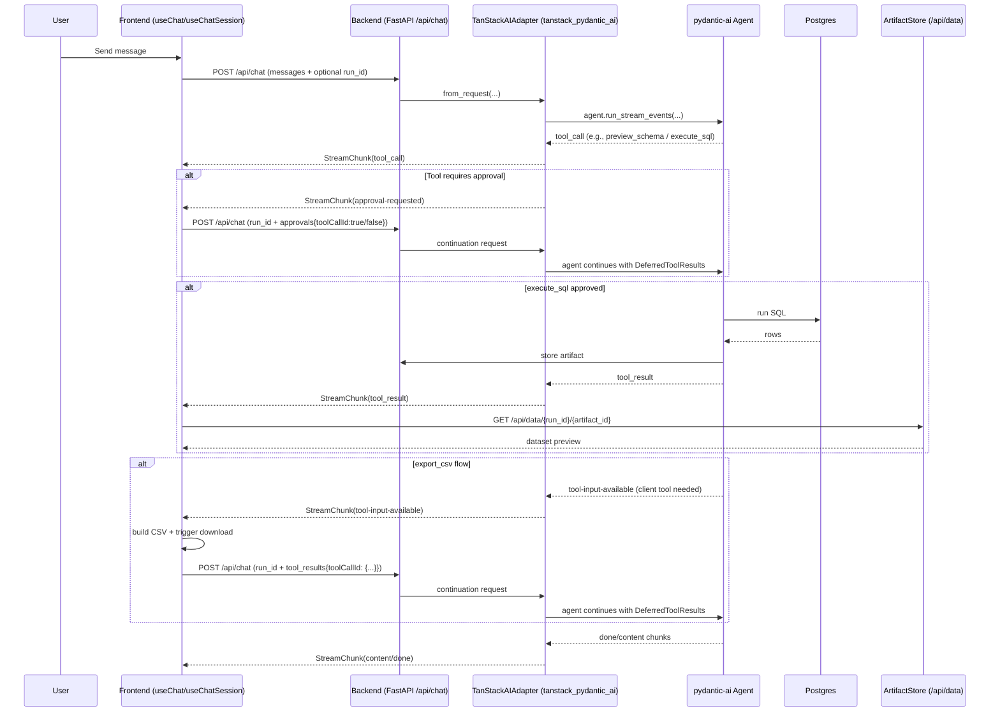

This maps directly to TanStack AI’s [StreamChunkType](https://tanstack.com/ai/latest/docs/reference/type-aliases/StreamChunkType) protocol:
- `content`
- `tool_call`
- `tool_result`
- `done`
- `error`
- `approval-requested`
- `tool-input-available`
- `thinking` (unused)
